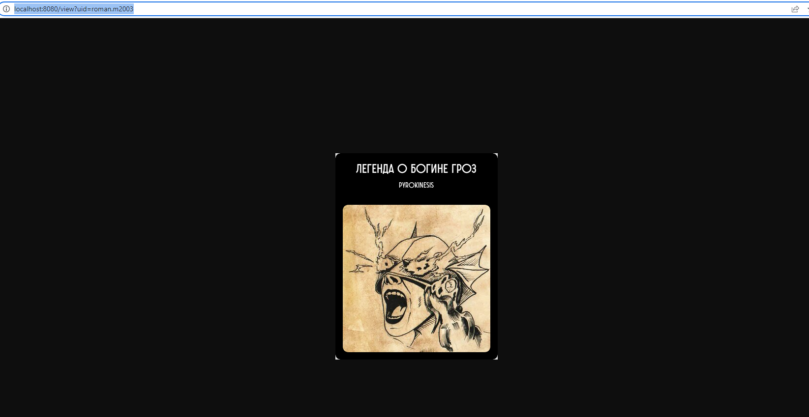
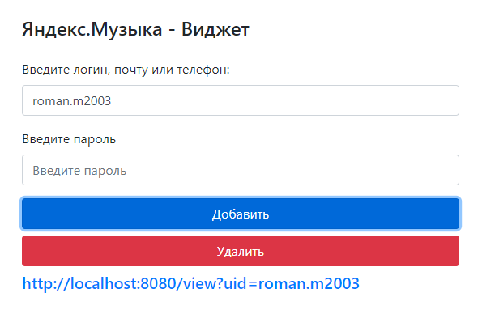
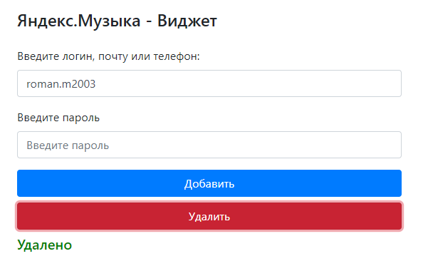

# Yandex Music Widget

### A cover of the track that he is currently listening to is generated for each user.

### To connect your account, enter your yandex account username and password and click "Add". A link to your widget will be displayed at the bottom. The account password is not sent to the server, but only to the yandex servers

### If you enter your username and password by clicking on the "Delete" button, the widget will stop working for your account.

## Installation instructions [here](https://github.com/StounhandJ/laravel-template#readme)
